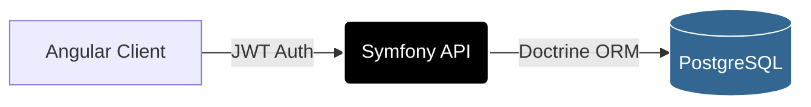

## 🚧 Proyecto en Desarrollo: 
Este repositorio es una muestra técnica de mi capacidad para construir aplicaciones con PHP/Symfony y Angular. Actualmente se encuentra en fase de construcción activa.


# 🏐 Volley-Assign - Sistema de Designación Arbitral.

[](https://www.php.net/)
[](https://symfony.com/)
[](https://developer.mozilla.org/en-US/docs/Web/JavaScript)
[](https://angular.io/)
[](https://www.postgresql.org/)
[](https://developer.mozilla.org/en-US/docs/Web/HTML)
[](https://tailwindcss.com/)
[](https://www.docker.com/)


Volley-Assign es una plataforma web integral diseñada para optimizar y automatizar la asignación de cuerpos colegiados en ligas de voleibol profesional y amateur.

El objetivo principal es eliminar los conflictos de agenda y asegurar que cada encuentro cuente con el personal calificado (Primer Árbitro, Segundo Árbitro, Anotador y Jueces de Línea) de forma transparente y eficiente.. Este repositorio es una muestra técnica de mi capacidad para construir aplicaciones robustas y seguras utilizando el ecosistema **PHP/Symfony** en el backend y **Angular** en el frontend.

---

## 🚀 Perfil Tecnológico Destacado

Como aspirante a Desarrollador Backend PHP, este proyecto ha sido el escenario para implementar estándares profesionales en Symfony:

* **Arquitectura de API RESTful:** Diseño de endpoints siguiendo los principios de statelessness y recursos bien definidos.
* **Seguridad Avanzada (JWT):** Implementación de autenticación mediante `lexik/jwt-authentication-bundle` para la protección de la zona administrativa.
* **Persistencia con Doctrine ORM:** Modelado de datos complejo, uso de repositorios personalizados y gestión de migraciones para PostgreSQL.
* **Validación de Datos:** Uso de *Constraints* de Symfony para asegurar la integridad de los datos en formularios y carga de archivos.
* **Gestión de Archivos:** Servicio de gestión de imágenes (upload/update/delete) integrado en el servidor Symfony.
* **Inyección de Dependencias:** Uso intensivo de servicios desacoplados para mantener un código limpio y mantenible (SOLID).

---

## 🛠️ Stack Tecnológico

### Backend
* **Framework:** Symfony 7.2.5
* **Lenguaje:** PHP 8.2.29 (uso de Atributos y Tipado Estricto).
* **Seguridad:** JWT (JSON Web Tokens).
* **Base de Datos:** PostgreSQL.
* **Infraestructura:** Docker & Docker Compose.

### Frontend
* **Framework:** Angular 19.2.8 (Standalone Components).
* **Estilos:** Tailwind CSS.
* **UX/UI:** ngx-toastr para notificaciones y Reactive Forms para validaciones en tiempo real.

### Arquitectura de Comunicación



---

## 🌟 Funcionalidades Clave

1.  **Seguridad de Usuario:** Sistema de Login y Registro con hashing seguro.

2.  **Dashboard:** Gestión centralizada protegida por roles.

3.  **Firma en Consola:** Mensaje de autoría personalizado mediante CSS en la consola del navegador para desarrolladores.

---

## 🗺️ Hoja de Ruta (Roadmap)

[ ] Estructura base del Backend con Symfony.

[ ] Apis probadas con Postman.

[ ] Configuración de JWT para seguridad.

[ ] login.

[ ] Dashboard de Gestor.

[ ] Dashboard de Arbitro.

[ ] Optimización de filtros de búsqueda avanzados en el Frontend (reactiveforms).

[ ] Generación de informes en PDF.


## 📦 Despliegue con Docker Compose

Este proyecto utiliza Docker y Docker Compose para desplegar una aplicación que incluye un backend Symfony, un frontend Angular y una base de datos PostgreSQL de manera rápida y sencilla. Esto garantiza que funcione exactamente igual en cualquier entorno.

---

## 🛠️ Requisitos Previos
Antes de comenzar, asegúrate de tener instalados en tu sistema:

- [Docker](https://docs.docker.com/get-docker/)
- [Docker Compose](https://docs.docker.com/compose/install/)
---

## 🚀 Instalación y Puesta en Marcha

### 1️⃣ Clonar el repositorio
Ejecuta el siguiente comando para clonar el proyecto:
```bash
git clone git@github.com:devserranoarocha/Volley-Assign.git
cd Volley-Assign
```

### 2️⃣ Levantar los contenedores
Para iniciar los servicios en segundo plano, ejecuta:
```bash
docker-compose up -d
```
📌 **Nota:** La primera vez que inicies los servicios, puede tardar unos minutos en configurarse completamente.

### 3️⃣ Verificar que los contenedores están corriendo
Comprueba el estado de los contenedores con:
```bash
docker ps
```
Deberías ver tres contenedores en ejecución: **PostgreSQL**, **Symfony (backend)** y **Angular (frontend)**.

### 4️⃣ Acceder a la aplicación
- **Frontend:** Abre la siguiente URL en tu navegador:
  ```
  http://localhost:4200
  ```
- **Backend (Symfony):** Puedes ver la salida de Symfony desde:
  ```
  http://localhost:8000
  ```
- **Base de datos PostgreSQL:** El contenedor de la base de datos está en el puerto 5432, aunque normalmente no es necesario acceder directamente a este servicio en un navegador.

---

## 🔄 Detener y Reiniciar los Contenedores
Si deseas detener los contenedores en ejecución:
```bash
docker-compose down
```
Para volver a iniciarlos:
```bash
docker-compose up -d
```

---

## 🧹 Eliminar los Contenedores y Datos Persistentes
Si quieres eliminar los contenedores junto con los volúmenes y datos almacenados:
```bash
docker-compose down -v
```
⚠️ **Advertencia:** Esto eliminará todos los datos almacenados en la base de datos PostgreSQL.

---

## 🎯 Notas Finales
- Para ver los registros en tiempo real:
  ```bash
  docker-compose logs -f
  ```

Para más información sobre **Symfony**, **Angular** o **PostgreSQL**, consultar sus respectivas documentaciones oficiales.

## Comandos útiles

- Para acceder al contenedor del Frontend Angular:
```
  docker exec -it volley_frontend sh
```

- Para acceder al contenedor del Backend Symfony:
```
docker exec -it volley_backend bash
```
- Si tienes problemas de permisos para levantar un contenedor, prueba a ejecutar el siguiente comando:

```
sudo chmod 775 -R (contenedor_de_Symfony_o_Angular_frontend)
Ej:
sudo chmod 775 -R angular-frontend
```